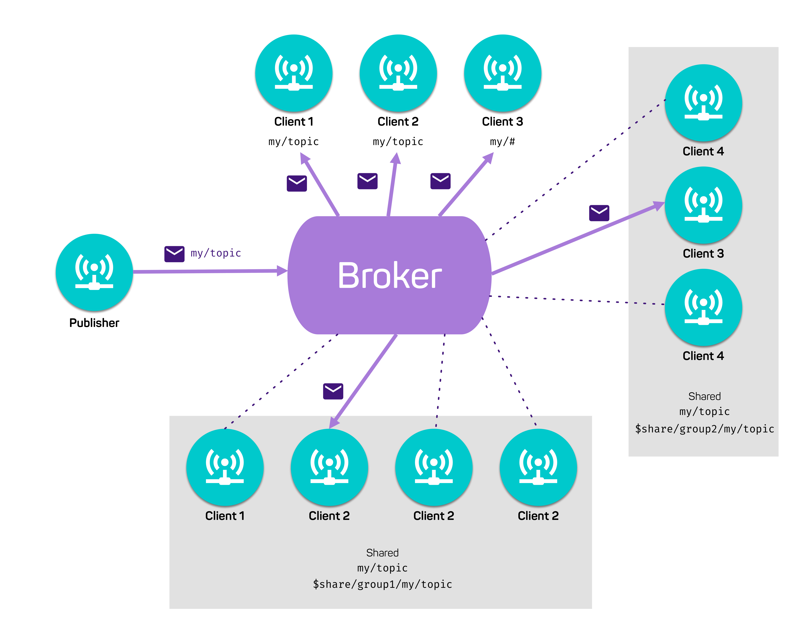

# Shared Subscription Groups with Emitter

A shared subscription is a mechanism for distributing messages to a set of subscribers to shared subscription topic, such that each message is received by only one subscriber. This contrasts with normal subscriptions where each subscriber will receive a copy of the published message.

A shared subscription is on the form $share/sharename/channel and subscribers to this topic will receive messages published to the channel. The messages will be distributed according to the defined distribution policy.





## Example Output

```
aircon 1 started
aircon 2 started
aircon 3 started
sensor started
aircon 1 received 37 degrees
aircon 3 received 13 degrees
aircon 1 received 33 degrees
aircon 3 received 8 degrees
aircon 1 received 9 degrees
aircon 2 received 16 degrees
aircon 1 received 32 degrees
aircon 2 received 7 degrees
aircon 1 received 26 degrees
aircon 2 received 28 degrees
aircon 1 received 33 degrees
aircon 2 received 19 degrees
aircon 1 received 6 degrees
aircon 2 received 15 degrees
aircon 1 received 24 degrees
aircon 2 received 10 degrees
aircon 1 received 30 degrees
aircon 2 received 38 degrees
aircon 1 received 0 degrees
aircon 2 received 15 degrees
aircon 1 received 26 degrees
aircon 2 received 30 degrees
aircon 1 received 11 degrees
aircon 2 received 19 degrees
aircon 1 received 22 degrees
aircon 2 received 37 degrees
aircon 1 received 35 degrees
aircon 3 received 1 degrees
aircon 2 received 9 degrees
```